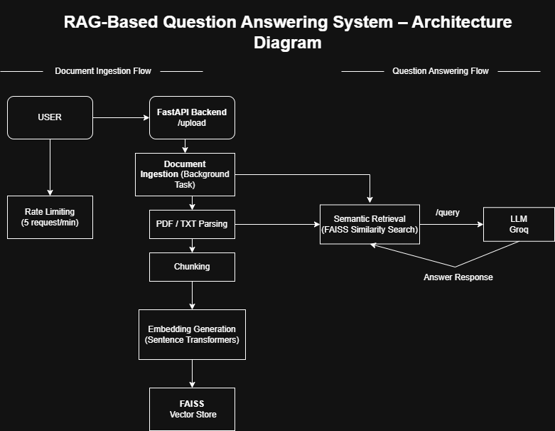

## 📌 Overview

This project implements a **Retrieval-Augmented Generation (RAG)** based Question Answering system.  
Users can upload documents and ask questions, and the system generates **context-aware answers** by retrieving relevant information from the uploaded documents and passing it to a Large Language Model (LLM).

The application is built as a **RESTful API using FastAPI** and demonstrates real-world concepts such as document ingestion, text chunking, embedding generation, vector similarity search, and LLM-based answer generation.

---

## 🚀 Features

- Upload documents in **PDF or TXT** format
- Automatic document chunking
- Embedding generation using **Sentence Transformers**
- Vector storage and similarity search using **FAISS**
- Context-aware answer generation using **Groq LLM**
- REST API interface using **FastAPI**
- Latency tracking for model response time

## 🛠️ Tech Stack

- **Backend Framework**: FastAPI  
- **Programming Language**: Python 3.12  
- **Embeddings Model**: Sentence Transformers (`all-MiniLM-L6-v2`)  
- **Vector Store**: FAISS  
- **LLM Provider**: Groq (`llama-3.1-8b-instant`)  
- **Document Parsing**: PyPDF  
- **Environment Management**: Python Virtual Environment  

## 📂 Project Structure
```text
rag-qa-system/
│
├── app/
│   ├── main.py        # FastAPI routes
│   ├── ingestion.py  # Document ingestion and chunking
│   ├── retrieval.py  # FAISS-based similarity search
│   ├── llm.py        # LLM response generation
│
├── rag_env/           # Virtual environment
├── .env               # Environment variables (API key)
├── requirements.txt   # Project dependencies
├── README.md
```
## 🧩 Architecture Overview

The system follows a standard Retrieval-Augmented Generation (RAG) pipeline:

1. User uploads a document (PDF/TXT) via the `/upload` API.
2. The document is parsed, chunked, and converted into embeddings.
3. Embeddings are stored in a FAISS vector index.
4. User submits a question via the `/query` API.
5. Relevant chunks are retrieved using vector similarity search.
6. Retrieved context is passed to the LLM to generate a grounded answer.

## ⚙️ Setup & Usage
Follow the steps below to run the project locally.

### 1️⃣ Clone the Repository
```bash
git clone <your-github-repository-url>
cd rag-qa-system
```
### 2️⃣ Create and Activate Virtual Environment
```bash
python -m venv rag_env
rag_env\Scripts\activate   # Windows
```
### 3️⃣ Install Dependencies
```bash
pip install -r requirements.txt
```
### 4️⃣ Configure Environment Variables
Create a `.env` file in the project root and add:
```env
GROQ_API_KEY=your_groq_api_key_here
```
### 5️⃣ Run the Application
```bash
uvicorn app.main:app --port 8001
```
Open Swagger UI:
```text
http://127.0.0.1:8001/docs
```

### 6️⃣ Use the API
- Upload a document using `POST /upload`
- Ask questions using `POST /query`

## 🔍 Example API Usage

### Upload Document
**Endpoint:** `POST /upload`  
**Description:** Upload a PDF or TXT document for ingestion.

---

### Ask Question
**Endpoint:** `POST /query`

**Sample Request:**
```json
{
  "question": "What is Rimpi Ghosh's educational background?"
}
```
**Sample Response:**
```json
{
  "answer": "Rimpi Ghosh completed her schooling at New English Medium School..."
}
```
## 🧠 Mandatory Explanations

### 🔹 Chunking Strategy

The documents are split into chunks of approximately **500 characters with a small overlap**.  
This chunk size was chosen to balance **context preservation** and **retrieval precision**.

- Smaller chunks can lose semantic meaning
- Very large chunks reduce retrieval accuracy and increase token usage
- Overlapping chunks help retain continuity across chunk boundaries

This strategy ensures efficient retrieval without exceeding LLM context limits.

---

### 🔹 Retrieval Failure Case

A retrieval failure case was observed when a question was asked that was **not present in the uploaded document**.
**Example:**
> “What are Rimpi Ghosh’s future career goals?”
In such cases, the system retrieves the closest semantic chunks but correctly avoids hallucination and responds that the information is **not available in the provided context**.

---

### 🔹 Metric Tracked
The system tracks **latency**, measuring the time taken by the LLM to generate a response after retrieval.
Latency is important for:
- Evaluating system performance
- Improving user experience
- Comparing different model configurations

## ✅ Evaluation Alignment
This project demonstrates:
- Effective document chunking and embedding strategy
- Accurate semantic retrieval using FAISS
- Clean API design using FastAPI
- Awareness of system performance through latency tracking
- Clear explanation of architectural and design decisions

## 🧩 System Architecture Overview
The following diagram illustrates the end-to-end architecture of the RAG-based Question Answering System, covering both document ingestion and question answering flows.

